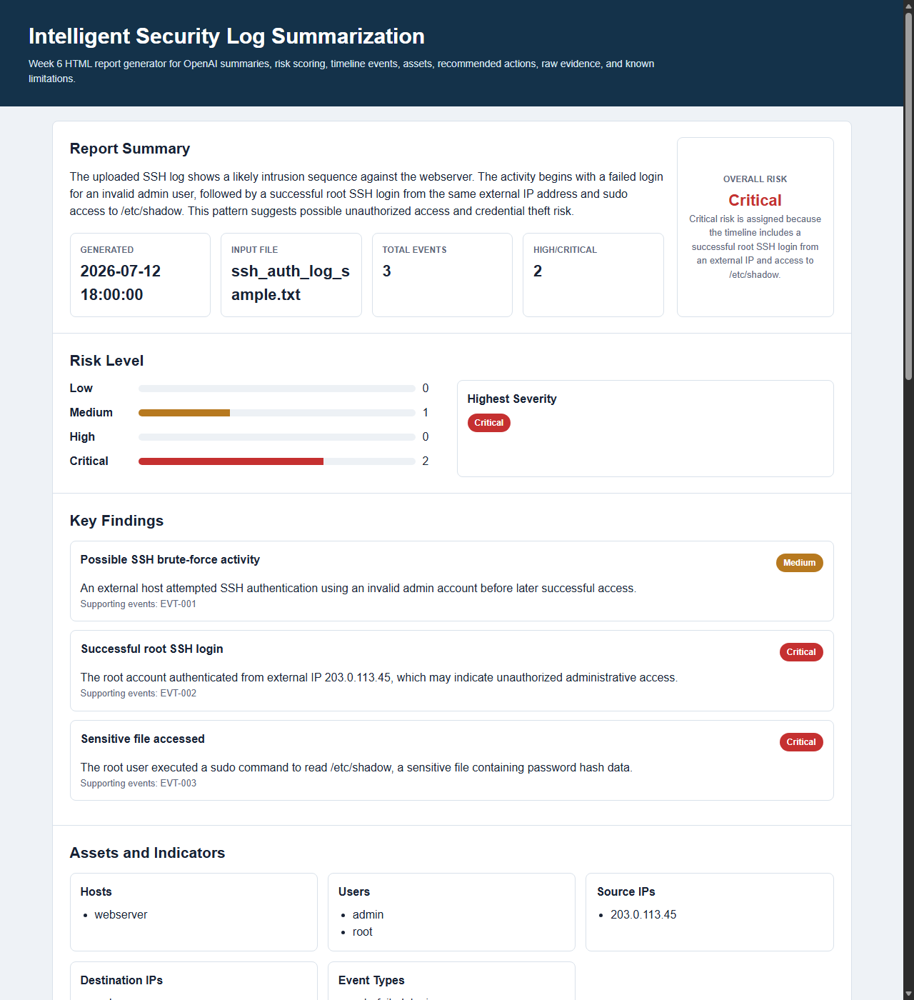

# Team Weekly Journal - Week 6

**Project:** Intelligent Security Log Summarization and Threat Timeline Generation  
**Course:** CSC 482 Capstone Project 2  
**Team:** Project Team 2  
**Team Members:** Derrick Redman, Zion Moore, Oriah Molton-Bowman  
**Week:** Week 6, July 6-July 12, 2026  
**GitHub Repository:** https://github.com/Dredman72/security-log-threat-timeline

## Milestones Achieved

### Milestone 1: End-to-End Report Generation Improved

The team advanced the Week 6 goal of end-to-end report generation. The Flask prototype now supports a stronger upload-to-report workflow where pasted or uploaded logs can be analyzed, summarized, displayed in report sections, shown in a chronological threat timeline, and reviewed through a parsed event preview.

Derrick improved the OpenAI report narrative and prompt behavior so the output is more useful for security review. The report now includes a generated timestamp, risk rationale, improved risk consistency, stronger recommendations, and cleaner timeline wording.

### Milestone 2: Backend Upload-to-Report Pipeline Documented

Zion completed the Week 6 backend pipeline documentation. The documented workflow explains how uploaded security logs move through parsing, normalization, chronological sorting, grouping, summary preparation, and report-ready output.

This supports the team goal because the final prototype needs a clear backend path from uploaded logs to report data that the OpenAI workflow and frontend can use.

### Milestone 3: HTML Report Data Fields Defined

Oriah completed the Week 6 report data fields and layout handoff documentation. Her work defines the major report sections and the data fields needed for the HTML report generator, including report summary, risk level, key findings, timeline events, assets and indicators, recommended actions, raw event details, and known limitations.

This helps make sure the frontend report layout matches the backend parser output and Derrick's OpenAI structured report output.

### Milestone 4: Week 6 Progress Tracking Updated

The team updated project tracking to show Week 6 progress. Derrick reviewed the team files, confirmed that Derrick, Zion, and Oriah completed their Week 6 responsibilities, and prepared the Week 6 team journal in the same layout as the Week 5 team journal.

## Subtasks Completed

| Member | Subtask | Brief Description |
| --- | --- | --- |
| Derrick | Improved report narrative and prompt behavior | Refined the report output so the summary, risk level, risk rationale, timeline events, evidence, and recommendations are clearer and more consistent. |
| Derrick | Added report timestamp | Added a generated report timestamp so each analysis result shows when the report was created. |
| Derrick | Added risk rationale | Added a short explanation for why the selected risk level is appropriate based on the log evidence. |
| Derrick | Improved repeated-event handling | Improved timeline behavior so repeated authentication failures can be grouped instead of producing too many duplicate timeline entries. |
| Derrick | Added reset workflow | Added a reset option so users can clear the current analysis and prepare the app for a new log review. |
| Derrick | Added downloadable report options | Added JSON and HTML download options so generated reports can be saved for evidence, review, or submission notes. |
| Derrick | Improved parsed event preview | Improved the parsed event preview so it displays useful fields such as timestamp, source, host, user, source IP, destination IP, event type, severity, and evidence. |
| Zion | Documented backend upload-to-report pipeline | Created documentation explaining how uploaded logs move through parsing, normalization, sorting, grouping, and report-ready output. |
| Zion | Supported report-ready backend structure | Confirmed the backend workflow can support summary generation, timeline generation, grouping, and report rendering. |
| Oriah | Defined Week 6 report data fields | Created documentation listing the report sections and fields needed by the HTML report generator. |
| Oriah | Confirmed report layout requirements | Confirmed the frontend should display summary, risk, key findings, timeline, assets/indicators, recommended actions, raw event details, and known limitations. |

## Testing of Subtasks With Evidence

### Test 1: Flask Report Workflow Review

**Purpose:** Confirm the Flask application can accept pasted logs and generate a structured security report.  
**Procedure:** Derrick ran the local Flask prototype, pasted sample SSH/firewall log data, and clicked **Analyze Logs**.  
**Expected Result:** The app should generate a report summary, risk level, attack type, risk rationale, assets and indicators, key findings, timeline, parsed event preview, recommended actions, and download options.  
**Result:** Passed. The app generated a structured report with the expected Week 6 report sections.

**Screenshot Evidence:**  
The screenshot shows the Flask app with pasted log data and the generated report summary, report timestamp, risk level, attack type, and risk rationale.

### Test 2: Report Summary and Risk Rationale Review

**Purpose:** Confirm the report explains both what happened and why the selected risk level is appropriate.  
**Procedure:** Derrick reviewed the generated report summary and risk rationale after analyzing the sample SSH incident logs.  
**Expected Result:** The report should explain the successful root login, sensitive `/etc/shadow` access, and why the event is High or Critical risk.  
**Result:** Passed. The report explains the attack narrative and connects the risk level to specific evidence from the logs.

**Screenshot Evidence:**  
The screenshot shows the report summary section with generated timestamp, risk level, attack type, and risk rationale.

### Test 3: Threat Timeline Review

**Purpose:** Confirm the timeline displays security events in chronological order with short event titles, severity, details, and evidence.  
**Procedure:** Derrick reviewed the generated threat timeline after analyzing the sample logs.  
**Expected Result:** Timeline events should include timestamp, source, severity, concise event title, details, and evidence. Repeated similar authentication failures should be grouped when possible.  
**Result:** Passed. The timeline showed the repeated authentication failures, successful root login, sensitive file read, additional failed login, and firewall block in chronological order.

**Screenshot Evidence:**  
The screenshot shows the Week 6 threat timeline with grouped repeated authentication failures and evidence lines.

### Test 4: Parsed Event Preview Review

**Purpose:** Confirm the parsed event preview supports the backend and frontend data handoff.  
**Procedure:** Derrick reviewed the parsed event preview table after running the sample log analysis.  
**Expected Result:** The preview should show timestamp, source, host, user, source IP, destination IP, event type, severity, and evidence.  
**Result:** Passed. The parsed event preview displays the fields needed for the LLM report and the frontend timeline.

**Screenshot Evidence:**  
The screenshot shows the parsed event preview table with source IP, destination IP, event type, severity, and evidence.

### Test 5: Backend Pipeline Documentation Review

**Purpose:** Confirm Zion's Week 6 backend work explains the upload-to-report workflow.  
**Procedure:** The team reviewed `docs/week6-backend-pipeline.md`.  
**Expected Result:** The document should explain how uploaded logs are parsed, normalized, sorted, grouped, prepared for summary/timeline output, and rendered into a report.  
**Result:** Passed. The document describes the backend pipeline from file upload to report-ready data.

**Screenshot Evidence:** Insert screenshot of `docs/week6-backend-pipeline.md` if needed for submission.

### Test 6: Report Data Fields Documentation Review

**Purpose:** Confirm Oriah's Week 6 frontend/report work defines the sections and data fields needed by the HTML report generator.  
**Procedure:** The team reviewed `docs/week6-report-data-fields.md`.  
**Expected Result:** The document should list the report sections and fields needed for the frontend report display.  
**Result:** Passed. The document defines report summary, risk level, key findings, timeline events, assets and indicators, recommended actions, raw event details, and known limitations.

**Screenshot Evidence:** Insert screenshot of `docs/week6-report-data-fields.md` if needed for submission.

### Test 7: Download and Reset Workflow Review

**Purpose:** Confirm the app supports saving the generated report and clearing the current log analysis.  
**Procedure:** Derrick reviewed the updated interface after analysis and confirmed the reset button and download section are available.  
**Expected Result:** Users should be able to reset the app for another scan and download the generated report as JSON or HTML.  
**Result:** Passed. The interface includes a reset button and download options for JSON and HTML report output.

**Screenshot Evidence:** Insert screenshot showing the reset button and download report buttons if needed for submission.

## Team Meetings

| Date | Attendees | Duration | Purpose |
| --- | --- | --- | --- |
| July 11, 2026 | Derrick Redman and Oriah Molton-Bowman | 30 minutes | Discussed Week 6 frontend/report expectations, report layout direction, and GitHub/project coordination. |
| July 12, 2026 | Derrick Redman, Zion Moore, and Oriah Molton-Bowman | 1 hour | Reviewed Week 6 completion status, confirmed each role's deliverables, and prepared the team journal/report evidence. |

## Lessons Learned

- The team learned that end-to-end report generation requires the backend, LLM prompt, and frontend report layout to use the same data structure.
- Derrick learned that the generated report is more useful when the model is asked to explain risk rationale and cite evidence clearly.
- Zion's backend pipeline documentation showed that upload-to-report logic needs clear stages: upload, parse, normalize, sort, group, summarize, and render.
- Oriah's report data field documentation showed that frontend design depends on predictable report sections and consistent event fields.
- The team learned that downloadable report output is useful for submitting evidence, reviewing generated reports later, and preparing demo materials.

## Contribution of Each Team Member

| Team Member | Role | Week 6 Contribution |
| --- | --- | --- |
| Derrick Redman | Team Leader + AI/LLM Specialist | Improved the OpenAI report narrative, risk consistency, risk rationale, report timestamp, repeated-event handling, reset workflow, downloadable report options, parsed event preview, and Week 6 documentation/report tracking. |
| Zion Moore | Backend & Log Processing Lead | Completed backend upload-to-report pipeline documentation showing how uploaded logs are parsed, normalized, sorted, grouped, and prepared for report output. |
| Oriah Molton-Bowman | Frontend & Visualization Lead | Completed Week 6 report data fields and layout handoff documentation defining the sections and fields needed for the HTML report generator. |

## Progress Compared to Project Plan

The team progressed according to the Week 6 project plan. Week 6 focused on end-to-end report generation, and the team completed the major pieces needed for the current prototype stage.

Derrick completed the report narrative and prompt-quality improvements. Zion completed the backend upload-to-report pipeline documentation. Oriah completed the report data fields and frontend layout handoff documentation. The app now better supports the planned workflow from log input to structured report output.

## Plan Adjustment

No major project plan adjustment is needed. The team will continue using the Flask/HTML prototype direction.

The next adjustment is to move into Week 7 integration testing and quality improvement. The team should test the app with more realistic sample logs, verify report consistency, polish the frontend display, and continue checking that backend fields support the final report output.

## Next Steps

| Owner | Next Step |
| --- | --- |
| Derrick | Continue improving prompt consistency, report quality, risk rationale, and generated recommendations during Week 7 testing. |
| Zion | Continue improving parser reliability, upload handling, and backend integration with report-ready data. |
| Oriah | Continue polishing the HTML report and timeline display using the Week 6 report data field structure. |
| Entire Team | Run integration tests, collect updated screenshots, and prepare for final demo hardening. |

## Team Sign-Off

Each team member should sign before submission.

| Team Member | Role | Signature | Date |
| --- | --- | --- | --- |
| Derrick Redman | Team Leader + AI/LLM Specialist |  |  |
| Zion Moore | Backend & Log Processing Lead |  |  |
| Oriah Molton-Bowman | Frontend & Visualization Lead |  |  |
