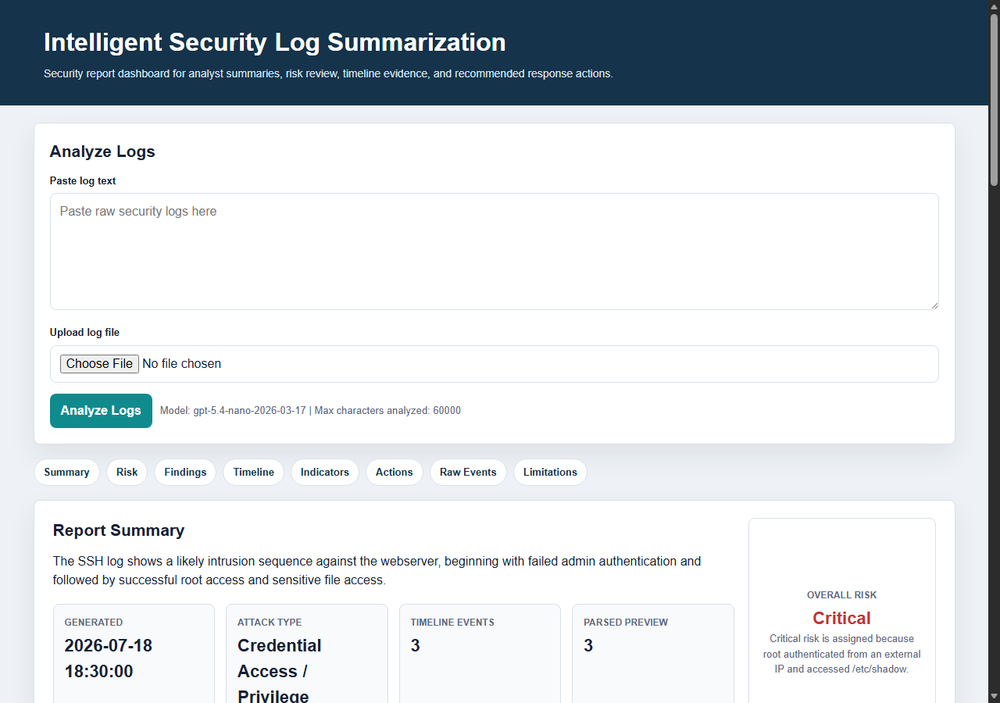

# Week 8: Oriah Frontend Walkthrough

## Purpose

This document records Oriah Molton-Bowman's Week 8 frontend presentation preparation for the final capstone demo.

Oriah's role is to explain the user-facing report layout, timeline visualization, and how the polished interface helps a user review security log activity.

## Frontend Demo Visual

Use this screenshot as the main frontend visual for the presentation:

## Walkthrough Order

During the frontend portion of the demo, Oriah should walk through the page in this order:

1. **Analyze Logs form**
   - Shows where a user can paste raw security logs or upload a supported log file.
   - Explains that this is the starting point for the upload-to-report workflow.

2. **Report Summary**
   - Shows the executive-style summary generated from the uploaded logs.
   - Helps the user quickly understand the likely security activity.

3. **Risk Level panel**
   - Shows the overall risk rating and risk rationale.
   - Helps the user quickly identify whether the incident appears low, medium, high, or critical.

4. **Key Findings**
   - Shows the most important security findings in a short, readable format.
   - Helps the user focus on the highest-value evidence instead of reading every raw log line first.

5. **Assets and Indicators**
   - Shows affected assets and indicators of compromise.
   - Helps connect the report to hosts, users, IP addresses, and suspicious activity.

6. **Threat Timeline**
   - Shows events in a chronological timeline format.
   - Includes timeline search and severity filtering so the user can narrow the view during review.

7. **Raw Event Details**
   - Shows parsed event evidence from the uploaded logs.
   - Helps support the AI-generated summary and timeline with source data.

8. **Recommended Actions**
   - Shows response steps for investigation, containment, or hardening.
   - Helps make the report actionable for a security analyst.

9. **Known Limitations**
   - Explains prototype limitations clearly.
   - Helps set expectations for what the current capstone version supports.

10. **Download buttons**
    - Shows that the report can be downloaded as JSON or HTML.
    - Supports review, evidence collection, and project submission.

## Short Presentation Script

> My role was Frontend and Visualization Lead. I worked on the report layout, timeline design, and final UI polish. The frontend helps users review security activity by organizing the report summary, risk level, key findings, indicators, timeline evidence, raw event details, recommended actions, and limitations into one browser-based report. The timeline search and severity filter make it easier to focus on important events during incident review.

## Evidence Checklist

| Done | Evidence | Location |
| --- | --- | --- |
| [x] | Polished report UI screenshot | `docs/screenshots/week7-ui.png` |
| [x] | Updated frontend template | `templates/index.html` |
| [x] | README frontend contribution summary | `README.md` |
| [x] | Week 8 frontend walkthrough notes | `docs/week8-oriah-frontend-walkthrough.md` |

## Status

Completed for Oriah's Week 8 frontend presentation preparation.
